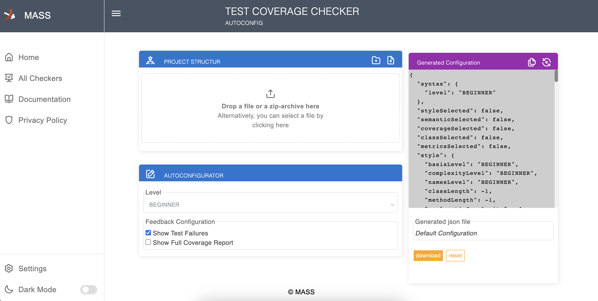
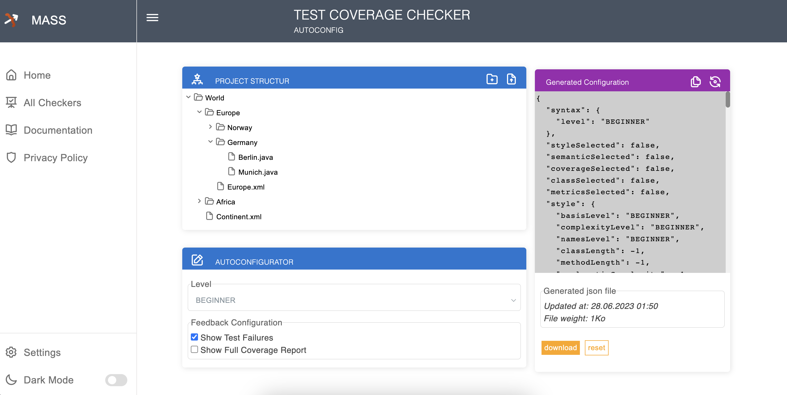

# MASS-Test-Coverage-Checker-Autoconfig

Main features
================================
* Edit the structure of the projects to be evaluated and make the edited project downloadable in zip format.
* Automatically generate MASS Test Coverage Checker configuration.

App usage process
==================
## Upload project files

## Edit the project Structure 

## Download the new structured project in zip format

## Copy or download JSON configuration

