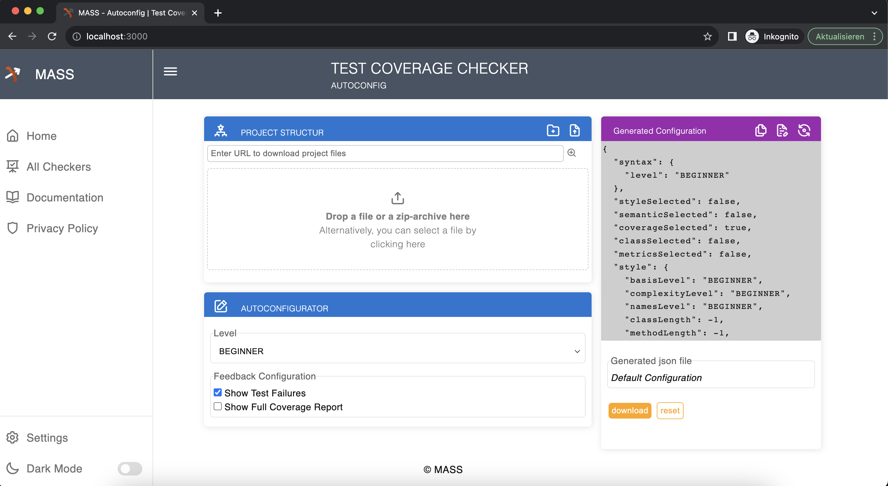
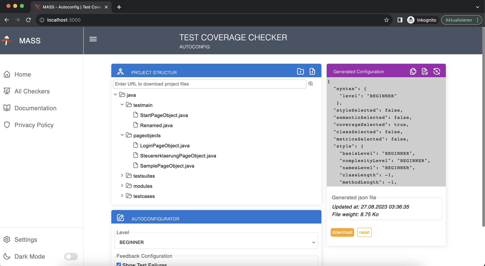
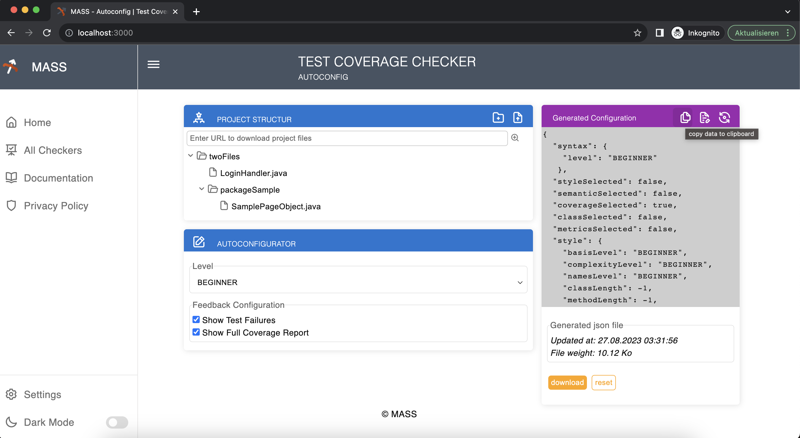
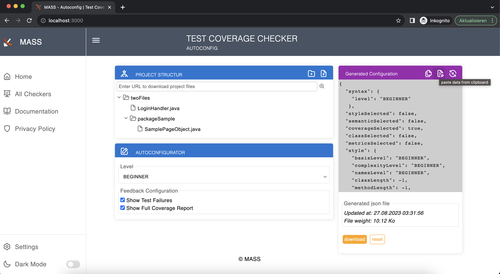

# MASS-Test-Coverage-Checker-Autoconfig

Main features
================================
* Automatically generate Value of the Test Coverage Checker for the Configuration's object for the MASS-Feedback-Tool from uploaded files.
* Edit the structure of the projects to be evaluated and generate the Configuration's object from edited Projektstructure.
* Copy and Download the generated Configuration's object for the MASS-Feedback-Tool.
* Merge values from another Configuration's object into the generated Object.

<br/>

App usage process
==================
## Upload project files


<br/>

## Add project files using an online url of a zip
Run the following commands to avoid CORS Error

* MacOS (in Terminal) :
    ```
    open -na Google\ Chrome --args --user-data-dir=/tmp/temporary-chrome-profile-dir --disable-web-security --disable-site-isolation-trials
    ```

* Windows (from "Run" dialog [Windows+R] or start menu in Windows 8+) : 
    ```
    chrome.exe --user-data-dir=%TMP%\temporary-chrome-profile-dir --disable-web-security --disable-site-isolation-trials
    ```


<br/>

## Edit the project Structure 


<br/>

## Copy or download JSON configuration


<br/>

##  Merge values from another Configuration's object

